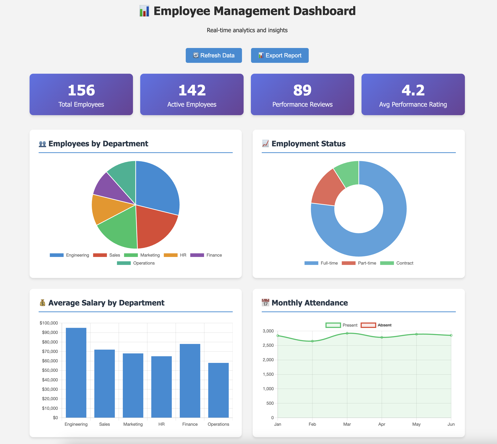

# Employee Management System API

A comprehensive Django REST API for managing employees, departments, and attendance with data visualization.

## 🎯 Project Overview

This project implements a full-featured employee management system with:
- RESTful APIs for CRUD operations
- Data analytics and visualization
- Swagger API documentation
- Admin interface for data management


## 🏗️ Architecture

```
employee_management_project/
├── employee_project/          # Main Django project
├── departments/               # Department management app
├── employees/                # Employee & performance management app
├── attendance/               # Attendance & leave management app
├── templates/                # HTML templates for dashboard
├── static/                   # Static files
└── manage.py                 # Django management script
```

## 🚀 Quick Start

### Prerequisites
- Python 3.8+
- pip (Python package manager)

### Installation

1. **Clone the repository**
   ```bash
   git clone <your-repo-url>
   cd employee_management_project
   ```

2. **Create virtual environment**
   ```bash
   python3 -m venv venv
   source venv/bin/activate  # On Windows: venv\Scripts\activate
   ```

3. **Install dependencies**
   ```bash
   pip install -r requirements.txt
   ```

4. **Set up environment variables**
   ```bash
   cp .env.example .env
   # Edit .env file with your configurations
   ```

5. **Run database migrations**
   ```bash
   python manage.py makemigrations
   python manage.py migrate
   ```

6. **Create superuser**
   ```bash
   python manage.py createsuperuser
   ```

7. **Generate sample data**
   ```bash
   python manage.py seed_data --employees 50
   ```

8. **Start the development server**
   ```bash
   python manage.py runserver
   ```

## 📱 Available Endpoints

### 🌐 Web Interface
- **Admin Panel**: http://127.0.0.1:8000/admin/
- **API Documentation**: http://127.0.0.1:8000/swagger/
- **Dashboard**: http://127.0.0.1:8000/dashboard/

### 🔧 API Endpoints

#### Departments
- `GET /api/departments/` - List all departments
- `POST /api/departments/` - Create new department
- `GET /api/departments/{id}/` - Get department details
- `PUT /api/departments/{id}/` - Update department
- `DELETE /api/departments/{id}/` - Delete department
- `POST /api/departments/{id}/activate/` - Activate department
- `POST /api/departments/{id}/deactivate/` - Deactivate department

#### Employees
- `GET /api/employees/` - List all employees
- `POST /api/employees/` - Create new employee
- `GET /api/employees/{id}/` - Get employee details
- `PUT /api/employees/{id}/` - Update employee
- `DELETE /api/employees/{id}/` - Delete employee
- `GET /api/employees/{id}/profile/` - Get employee profile with stats
- `POST /api/employees/{id}/activate/` - Activate employee
- `POST /api/employees/{id}/deactivate/` - Deactivate employee

#### Performance
- `GET /api/performance/` - List performance reviews
- `POST /api/performance/` - Create performance review
- `GET /api/performance/{id}/` - Get review details
- `PUT /api/performance/{id}/` - Update review
- `DELETE /api/performance/{id}/` - Delete review

#### Attendance
- `GET /api/attendance/` - List attendance records
- `POST /api/attendance/` - Create attendance record
- `POST /api/attendance/bulk_create/` - Bulk create records
- `GET /api/attendance/summary/` - Get attendance summary
- `GET /api/attendance/analytics/` - Get attendance analytics

#### Leave Requests
- `GET /api/leave-requests/` - List leave requests
- `POST /api/leave-requests/` - Create leave request
- `POST /api/leave-requests/{id}/approve/` - Approve request
- `POST /api/leave-requests/{id}/reject/` - Reject request

#### Analytics
- `GET /api/analytics/` - Employee analytics data

## 📊 Features

### Core Features
- ✅ Employee CRUD operations
- ✅ Department management
- ✅ Attendance tracking
- ✅ Performance reviews
- ✅ Leave request management
- ✅ Data filtering, searching, and sorting
- ✅ Swagger API documentation

### Advanced Features
- ✅ Data analytics and insights
- ✅ Interactive dashboard with charts
- ✅ Bulk operations
- ✅ Employee profile with stats
- ✅ Admin interface
- ✅ Input validation and error handling

## 🔍 API Usage Examples

### Create a Department
```bash
curl -X POST http://127.0.0.1:8000/api/departments/ \
  -H "Content-Type: application/json" \
  -d '{
    "name": "Engineering",
    "description": "Software development team"
  }'
```

### Get Employee Analytics
```bash
curl -X GET http://127.0.0.1:8000/api/analytics/
```

### Filter Employees by Department
```bash
curl -X GET "http://127.0.0.1:8000/api/employees/?department=1&employment_status=ACTIVE"
```

## 🧪 Testing

### Manual Testing
1. Access Swagger UI at http://127.0.0.1:8000/swagger/
2. Use the interactive interface to test all endpoints
3. Verify CRUD operations work correctly

### API Testing with curl
```bash
# Test department creation
curl -X POST http://127.0.0.1:8000/api/departments/ \
  -H "Content-Type: application/json" \
  -d '{"name": "Test Dept", "description": "Testing"}'

# Test employee list
curl -X GET http://127.0.0.1:8000/api/employees/
```

## 🛠️ Technology Stack

- **Backend**: Django 4.2.7, Django REST Framework 3.14.0
- **Database**: SQLite (development), PostgreSQL (production)
- **API Documentation**: drf-yasg (Swagger)
- **Data Visualization**: Chart.js
- **Data Generation**: Faker
- **Filtering**: django-filter

## 📦 Dependencies

```txt
Django==4.2.7
djangorestframework==3.14.0
drf-yasg==1.21.7
django-environ==0.11.2
Faker==20.1.0
django-filter==23.4
djangorestframework-simplejwt==5.3.0
django-cors-headers==4.3.1
```

## 🗂️ Database Schema

### Models
- **Department**: Company departments
- **Employee**: Employee information and employment details
- **Performance**: Employee performance reviews
- **Attendance**: Daily attendance records
- **LeaveRequest**: Employee leave applications

### Relationships
- Employee belongs to Department (ForeignKey)
- Performance belongs to Employee (ForeignKey)
- Attendance belongs to Employee (ForeignKey)
- LeaveRequest belongs to Employee (ForeignKey)

## 🚀 Deployment

### Local Development
```bash
python manage.py runserver
```

### Production Considerations
- Use PostgreSQL database
- Set up proper environment variables
- Configure static file serving
- Set up proper logging
- Use a WSGI server like Gunicorn

## 🤝 Contributing

1. Fork the repository
2. Create a feature branch
3. Make your changes
4. Add tests if applicable
5. Submit a pull request

## 📄 License

This project is created for educational purposes.
